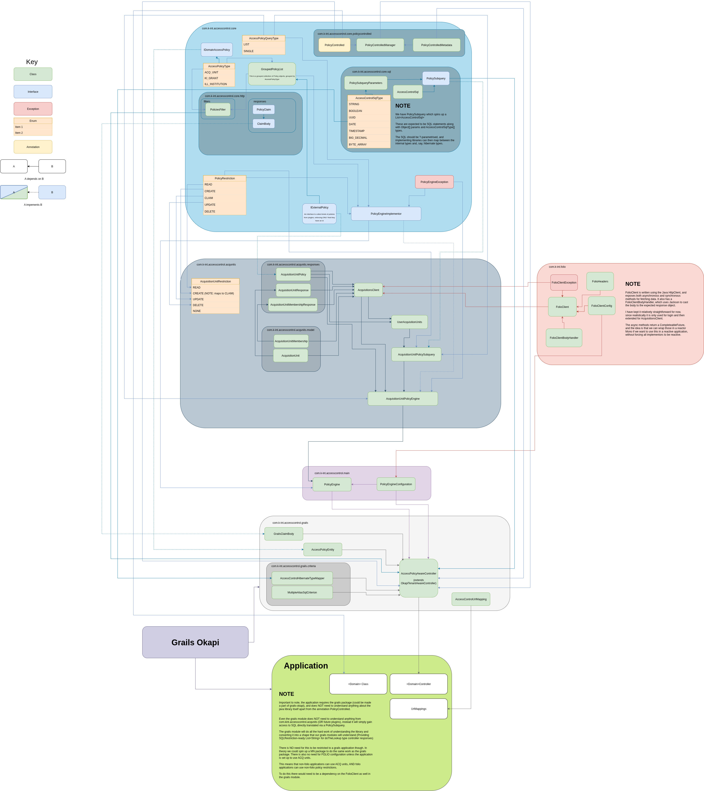

Access control (RBAC) and inner-tenant separation
=================================================
   
# Introduction
Access control is an important aspect of an application,
allowing shared data to be accessed by different parties depending on some level of access granted them on the 
system. In particular in FOLIO, the data is separated across tenant lines with a separate schema for each tenant in 
the database. This is a particular issue in the likes of mod-agreements, where there is an additional set of data 
(the local KB) which is then needed to be ingested for each and every tenant.

# Planning and strategy
## Original plan
Originally, the access control model planned for these KInt modules was to use a "grant" based system for true ABAC 
(attribute based access control) and RBAC (role based access control). This would have been a departure from the 
existing model present in FOLIO "Acquisition units" but would have provided a significantly more robust access 
control system. However the complexity of this system, coupled with the desire for whatever model was chosen to ALSO 
be compatible with these Acquisition units, led to that work being postponed. It is still desirable at some point in 
the future, but for now the implementation will focus on acquisition units.
## Final strategy
The final strategy was to create an external java library which would handle the bulk of operations around access 
control. It would need to be framework agnostic, so that it could be lifted in the future if/when the grails modules 
are rewritten in Micronaut, and to make as few assumptions about the calling code as possible. This design ethos led 
to the development of the current AccessControl package in mod-agreements, which will be lifted out as an external 
library when the first implementation in another module is required.

# Acquisition units
Acquisition units represent a model chosen by the acquisition team to perform this kind of access control in FOLIO.
They have since been adopted into other modules such as finance, as well as others.

## Implementation
The implementations of this in the various modules seems to be written directly into each module's codebase, and
does not allow for extensions to some other form of RBAC in future, so using the code that already existed is not
an option for us. In addition the ownership of a resource by acquisition units is determined by a field on the 
resource itself. This is not a model we are willing to replicate directly, especially with potential future work to 
allow other forms of RBAC.

## Behaviour
Acquisition units are set up in FOLIO > Settings > Acquisition units
These are named, and can have FOLIO users assigned to them. They allow for 4 basic protections:
- `protectRead`
- `protectUpdate`
- `protectCreate`
- `protectDelete`

Each of these can be "restricted" or "not restricted" for any given acquisition unit.
The behaviour of these is not necessarily immediately intuitive from the names.

`protectRead`, `protectUpdate` and `protectDelete` protection work largely as 
expected, any resource "owned" by an acquisition unit with `protectRead` restriction, say, will only show up in 
searches for users of that acquisition unit and direct API calls for that resource will be restricted likewise.

`protectCreate` however does _not_ restrict the creation of new resources. Since the acquisition units live on 
resources themselves, what this _actually_ protects is the ability to assign said unit to a given resource. 
Slightly confusingly this restriction applies both to assigning a unit to a new resource (on create) but _also_ to 
assigning a unit on an existing resource (on edit). This means that a user who is not assigned to any of the 
`protectCreate` restricted units will still be able to create a new resource (FOLIO permissions permitting), but 
will not be able to assign any acquisition units to it (simplified slightly--see below)

The simplification above comes from the fact that a unit can be valid for a resource _without_ a certain protection 
present, and also the behaviour when two or more units are present for a single resource.

If resource A is owned by unit 1, and unit 1 has:

- `protectRead` ⬜
- `protectUpdate`✅
- `protectCreate`✅
- `protectDelete`✅

Then read is treated as not restricted for that resource at all, but updates and deletes _will_ be restricted, and 
only users on that unit will be allowed to assign the unit to resources.

If unit 2 was then added to the resource, and restricted as follows:
- `protectRead` ✅
- `protectUpdate`✅
- `protectCreate`⬜
- `protectDelete`✅

Then the behaviour becomes a little more confusing. Read is now UNRESTRICTED by unit 1 and RESTRICTED by unit 2. 
This means in practise that only users in unit 2 are allowed to read the resource. (In actualilty at the moment this 
is not true. It is the behaviour when UPDATE is restricted/unrestricted for a single resource, but NOT for READ. We 
are in discussions with the Acquisition lead to understand if this discrepancy is intended.)

Update is RESTRICTED for unit 1 _and_ for unit 2. The chosen behaviour here for FOLIO is permissive, so if the user 
is a member of unit 1 _or_ unit 2 then write access will be granted, similarly for delete.

Create is RESTRICTED for unit 1 and UNRESTRICTED for unit 2. This manifests as _any_ user (who has write access to 
the resource) being able to assign unit 2 to the resource, but only members of unit 1 being able to do the same for 
that unit. Unit 2 is set up in such a way that a user could "soft lock" themselves out of a resource they created if 
they're not a member of unit 2.

# AccessControl design
The design of the access control work is encapsulated by the following diagram (Click to enlarge)

## Overview
The basic approach is as follows. Each module will be responsible for several "PolicyControlled" resources. These 
resources will not need to change, no addition of "access control" fields etc etc. If a resource is API accessible 
and owned by some other PolicyControlled resource then the access policies on the _owner_ will determine access to 
the resource. This will all be managed via an @PolicyControlled tag on the resource.

A separate table for AccessPolicyEntities will act as a join between policies from an external system (external to 
the module, such as Acquisition units, or even external to FOLIO, such as KI Grants potentially in future. In 
theory nothing prevents an internal access system but that has not been planned for.)

When a resource is accessed through some sort of framework (Grails, micronaut, etc), an intepretation layer will 
provide the API calls, either intercepting normal CRUD operations or providing helper API calls such as `canRead` etc.

This framework layer will call down to a pure java library PolicyEngine, which will parse which types of access control 
are to be performed (ACQ_UNIT vs KI_GRANT etc) and delegate specific logic to several pure java plugins to perform the 
business logic, before combining the results and returning them to the framework layer.

## Structure
The structure of this work as delivered is as follows:
- Core (com.k-int.accesscontrol.core)
- Main (com.k-int.accesscontrol.main)
- Acquisition unit plugin (com.k-int.accesscontrol.acqunits)
- Grails framework layer (com.k-int.accesscontrol.grails)

As per the overview, we have the "main" java library, which is interracted with by the "framework layer" which in 
turn can be imported into each implementing module.

The "main" library delegates the acquisition unit logic to a "plugin" library, and all 3 of those are shaped by 
interfaces and classes available from the "core" library.

As can be seen from the diagram, this leads to a fairly natural separation of concerns at each layer.

- The final module should _only_ need to import the framework
  layer itself
    - The one exception being the annotation @PolicyControlled from the core library.
- The grails framework layer is _only_ aware of the "main" and "core" libraries
- The main library is responsible for connecting to each access control plugin, but doesn't need to be aware of how 
  they function
    - It also imports from the core library
- The acquisition unit layer takes some interfaces and classes from core
  - It also utilises another java package for performing FOLIO Http calls. This client could be extended and 
    provided outside of an AccessControl context at some point.
  - Importantly though, the use of it is limited only to the plugin layer
    - Technically the framework layer needs to utilise it to configure the main engine, which in turn configures the 
      plugin engines, which in turn configures the FOLIO client. This could be avoided via passing discrete values 
      into a constructor instead of using an imported client config class if we wished.

> ⚠️ WIP: document still under construction. ️⚠️

## Core layer
## Plugin layer
## Main layer
## Framework layer
## Module layer