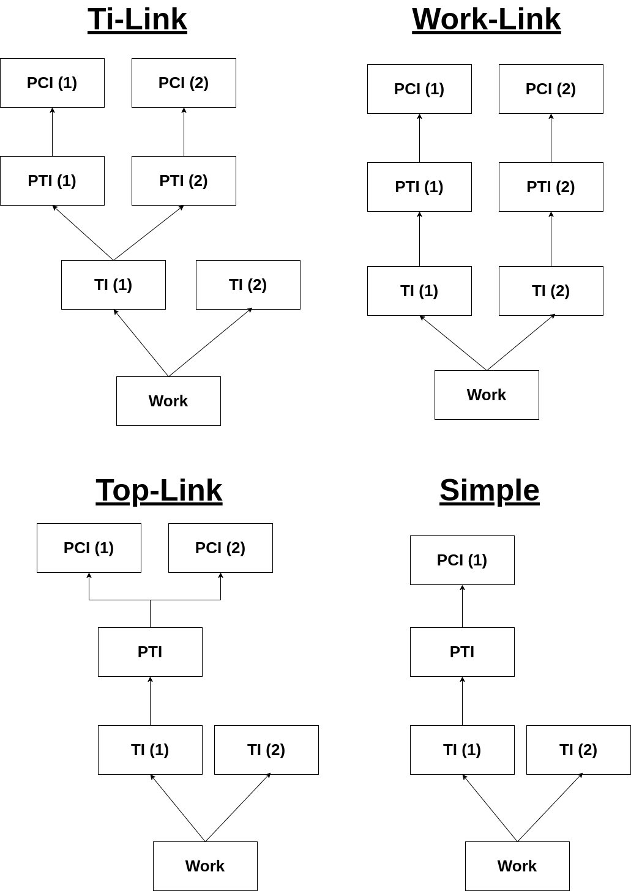
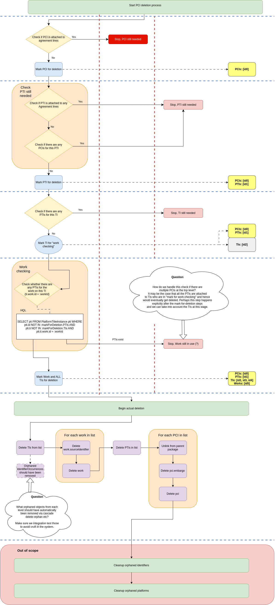

# Resource Deletion Documentation

## Problem Space

Users need a way to delete resources that have been harvested but are not in use and are no longer required. 

A user should be able to select one or more PCIs for deletion. The API should also allow for PTIs or TIs to be deleted. The API should only allow one resource type for deletion in each request.

A user should only be able to delete PCIs or packages that are not linked to agreement lines. 

If a user selects a PCI for deletion, any resources that are referenced by it cannot be deleted if they are referenced by other PCIs that haven't been marked for deletion. 

Resources can reference one another in various shapes. The most common would be a Work referencing two TIs, and one of those TIs referencing a PTI, which references one PCI. 

A diagram below shows all four structures that might exist between resources and therefore need to be tested.




## ErmResourceService::markForDelete() and ErmResourceService::deleteResources()


### Mark For Delete ([Code](https://github.com/folio-org/mod-agreements/blob/7846ef876b4ea679f55f8ef71c3fcd44a767d8cb/service/grails-app/services/org/olf/ErmResourceService.groovy#L117)

See the Code Breakdown section below for a more detailed explanation of the logic.

There are four stages in the mark for deletion process:

1) Collect PCIs. Check if any still needed.


2) Collect PTIs. Check if any still needed.


3) Collect TIs. Check if any still needed.


4) Collect Works. Check if the works are still needed, if not, use the work to assign all TIs for deletion. 

Each step effectively involves checking resources at the current level which are valid for deletion, then using these to identify resources at the next level which need checking for deletion.




The delete resources method [Code](https://github.com/folio-org/mod-agreements/blob/7846ef876b4ea679f55f8ef71c3fcd44a767d8cb/service/grails-app/services/org/olf/ErmResourceService.groovy#L292):

Deletes each resource type and saves which IDs are deleted in the response. Any directly linked entities such as Identifier Occurrences for TIs, or Embargos for PCIs, get deleted via Grail's orphan removal cascade.

## The API implementation

Endpoints look like: 

POST {{baseUrl}}/erm/resource/markForDelete/[resource_type]

POST {{baseUrl}}/erm/resource/delete/[resource_type]

where *resource_type* can be one of "pci", "pti", "ti".

Both endpoints accept a request body like: 

```{"resources": ["resource_id"]}```

The request body requires a minimum size of one resource id, or it will throw a validation error. The request body should only include resource ids of the resource_type parameter used. Any ids that cannot be found for a chosen resource_type will be skipped.

We implemented separate [/delete](https://github.com/folio-org/mod-agreements/blob/da1f030fd174d3efab1aa38aca5b7553331f58c0/service/grails-app/controllers/org/olf/ResourceController.groovy#L489) and [/markForDelete](https://github.com/folio-org/mod-agreements/blob/da1f030fd174d3efab1aa38aca5b7553331f58c0/service/grails-app/controllers/org/olf/ResourceController.groovy#L463) endpoints. This allows potential in the future for users to query which resources will be deleted, prior to carrying out the delete.

The /delete/pkg endpoint creates a job to run the delete, as for large packages the delete can take a long time. It returns a response shape like:

```
{
  "id": "645f10c3-9529-4257-89ae-d89d9c91b04c",
  "deletionJobType": "PackageDeletionJob",
  "dateCreated": 1750859036777,
  "packageIds": "[\"8def5448-0a20-4740-955d-597ae3bfc11d\"]",
  "name": "ResourceDeletionJob, package IDs: [8def5448-0a20-4740-955d-597ae3bfc11d] 2025-06-25T13:43:56.679467501Z",
  "status": {
    "id": "ff80818197a6e1b00197a6e1f5010035"
  }
}
```

The /delete/{pci/pti/ti} endpoint returns a response shape like:

```
{
  "deleted": {
    "resourceIds": {
      "pci": [
        "cd72744d-7f8c-44d0-b783-353cff04118e"
      ],
      "pti": [
        "8fc228b7-d59f-41b1-b7a8-f5099d66df49"
      ],
      "ti": [
        "5deff56b-431b-4803-8816-7055ef28b0b4",
        "ca965893-e3e4-4a65-b7fa-2bb9af17bf40"
      ],
      "work": [
        "0fdbe743-31be-471e-bcd4-3f7236c99a8c"
      ]
    },
    "statistics": {
      "pci": 1,
      "pti": 1,
      "ti": 2,
      "work": 1
    }
  },
  "markedForDeletion": {
    "resourceIds": {
      "pci": [
        "cd72744d-7f8c-44d0-b783-353cff04118e"
      ],
      "pti": [
        "8fc228b7-d59f-41b1-b7a8-f5099d66df49"
      ],
      "ti": [
        "5deff56b-431b-4803-8816-7055ef28b0b4",
        "ca965893-e3e4-4a65-b7fa-2bb9af17bf40"
      ],
      "work": [
        "0fdbe743-31be-471e-bcd4-3f7236c99a8c"
      ]
    },
    "statistics": {
      "pci": 1,
      "pti": 1,
      "ti": 2,
      "work": 1
    }
  }
}
```

/markForDelete/pkg returns a response shape like:

```
{
  "packages": {
    "e787f741-ef80-4f85-9ba0-1a68083ede13": {
      "resourceIds": {
        "pci": [
          "cd72744d-7f8c-44d0-b783-353cff04118e"
        ],
        "pti": [
          "8fc228b7-d59f-41b1-b7a8-f5099d66df49"
        ],
        "ti": [
          "5deff56b-431b-4803-8816-7055ef28b0b4",
          "ca965893-e3e4-4a65-b7fa-2bb9af17bf40"
        ],
        "work": [
          "0fdbe743-31be-471e-bcd4-3f7236c99a8c"
        ]
      },
      "statistics": {
        "pci": 1,
        "pti": 1,
        "ti": 2,
        "work": 1
      }
    }
  },
  "statistics": {
    "pci": 1,
    "pti": 1,
    "ti": 2,
    "work": 1
  }
}
```

/markForDelete/{pci/pti/ti} returns a response shape like:
```
{
  "resourceIds": {
    "pci": [
      "cd72744d-7f8c-44d0-b783-353cff04118e"
    ],
    "pti": [
      "8fc228b7-d59f-41b1-b7a8-f5099d66df49"
    ],
    "ti": [
      "5deff56b-431b-4803-8816-7055ef28b0b4",
      "ca965893-e3e4-4a65-b7fa-2bb9af17bf40"
    ],
    "work": [
      "0fdbe743-31be-471e-bcd4-3f7236c99a8c"
    ]
  },
  "statistics": {
    "pci": 1,
    "pti": 1,
    "ti": 2,
    "work": 1
  }
}
```

We would expect users to be deleting all resources inside a package. Therefore a /pkg endpoint exists:

POST {{baseUrl}}/erm/resource/markForDelete/pkg 

This endpoint collects all the IDs for PCIs in the package, then runs the internal delete method using that list of PCIs.

The /pkg endpoint only accepts one Pkg ID in the list in the request body.

The /pkg endpoint response shape will 

## Permissions

Group-level perms:

```
{
  "permissionName": "erm.resources.delete",
  "displayName": "ERM delete resources",
  "description": "Mark resources for deletion and delete them",
  "subPermissions": [
    "erm.resources.delete.collection.execute",
    "erm.resources.markForDelete.collection.execute"
  ]
}
```

Endpoint-level perms:

```
{
  "methods": [
    "POST"
  ],
  "pathPattern": "/erm/resource/delete/*",
  "permissionsRequired": [
    "erm.resources.delete.collection.execute"
  ]
},
{
  "methods": [
    "POST"
  ],
  "pathPattern": "/erm/resource/markForDelete/*",
  "permissionsRequired": [
    "erm.resources.markForDelete.collection.execute"
  ]
}

```

Perm descriptions:

```
 {
    "permissionName": "erm.resources.markForDelete.collection.execute",
    "displayName": "ERM: Mark for delete resource collection",
    "description": "Allows POST to mark resources for deletion.",
    "visible": false
  },
  {
    "permissionName": "erm.resources.delete.collection.execute",
    "displayName": "ERM: Delete resource collection",
    "description": "Allows DELETE of resources from the DB",
    "visible": false
  }
```

## Testing

Each test case depends on the resource relationship structure, which resources are selected for deletion, and which resources are attached to agreement lines.

Any resource(s) of the same type can be marked for deletion, and no resources, PTIs, PCIs or a mixture could be attached to agreement lines. 

For example:

In the simple structure, the resources available are: PCI, PTI, 2x TI, Work. This means that a PCI, PTI, TI, or both TIs could be selected for deletion. The PCI, PTI, both, or neither, could also be attached to agreement lines.

We chose to test these using a combinatorial approach by leveraging the Spock "where" block.

[Code](https://github.com/folio-org/mod-agreements/blob/da1f030fd174d3efab1aa38aca5b7553331f58c0/service/src/integration-test/groovy/org/olf/DeleteResources/ResourceDeletionSpec.groovy#L187)
```java
where:
    testCase << allVerificationTestCases.collect { it }

```

In order to generate the test cases, the setupSpec() method needs to define which combinations of input resources and agreement lines can exist for each structure. These can then be iterated over, and their values used as [keys](https://github.com/folio-org/mod-agreements/blob/da1f030fd174d3efab1aa38aca5b7553331f58c0/service/src/integration-test/groovy/org/olf/DeleteResources/ResourceDeletionSpec.groovy#L78) to fetch expected responses from a JSON file.

[Code](https://github.com/folio-org/mod-agreements/blob/da1f030fd174d3efab1aa38aca5b7553331f58c0/service/src/integration-test/groovy/org/olf/DeleteResources/ResourceDeletionSpec.groovy#L93)
```java
allVerificationTestCases.add([
                structure: structure,
                resourceTypeToMark: resourceTypeToMark, // pci, pti, ti
                currentInputResources: inputResourceCombo,
                currentAgreementLines: agreementLineCombo,
                doDelete: doDeleteFlag,
                expectedMarkForDelete: expectedValue,
                initialKbStats: new HashMap<>(loadedKbStats[structure])
              ])
```

This approach means that, assuming the structure, resources and agreement lines stay the same, if we want to change the actual test method we only need to change it in one place, as opposed to in many separate tests. 

Each test does the same things:

- Clears the resources from the previous test
- Loads in the resources for the current test (e.g. the simple structure resources)
- Gets the IDs of the input resources and agreement lines for the current test.
- Creates the agreement line, then hits either the /markForDelete or /delete endpoint.
- Asserts that the ids deleted or marked for deletion match the expected ids, and if the number of resources existing in the database before and after the methods are called matches the expected number.

It also means that if e.g. new resources are added to the code that generates test cases for a structure, test cases missing expected values are flagged via an exception, making it more difficult to accidentally omit a test. 

A specific "language" is used in the tests to describe which resources should be marked for deletion after creation by the database. If two packages are used to generate resources for a structure, one package is assigned "package 1" and another "package 2". Resources belonging to each package are then assigned as PCI1 or PCI2, PTI1 or PTI2 etc... In the case when there is e.g. only one PCI/PTI, the lower number (usually PTI1) is used.  Several methods in the DeletionBaseSpec parse this language (e.g. PCI1) into the correct ID, which allows us to write tests like: Expect PCI1 is deleted --> PCI1 was deleted. This is necessary because different groups of resources need to be distinguishable as they lead to different deletion outcomes depending on which are selected for deletion or attached to agreement lines.

Extending the scenarios list itself is slightly more complicated and would depend on the desired change:

Example: Adding a new "structure"

If we decided another structure needed testing, several updates would need to be made:

- The JSON file containing expected values would need to be updated to include the new structure.
- resourcesForAgreementLinesStructure must include any resources that can be attached to agreement lines.
- inputResourceCombinationsByStructure must contain all possible combinations of input resources (those selected for deletion) in a structure.
- agreementLineCombinationsByStructure must then contain all possible combinations of resources that could be attached to agreement lines.
- New test packages would need to be defined that generate the resource structure desired.
- DeletionBaseSpec::seedDatabaseWithStructure() must include the new structure and import the new test packages.
- DeletionBaseSpec::findPackageName() must define the new package name.
- DeletionBaseSpec::parseResource() might need to be updated to define how to find any new resources in the database. 

### Code Breakdown

#### MarkForDeleteInternal()

The main constraint we faced is that some packages have >65535 items in them. This means that when trying to markForDelete() a package, we end up with a set of more than 65535 strings (ids for PCIs). Carrying out the MarkForDelete logic using HQL and named query parameters means doing something like:

```
Account.executeQuery("select distinct a.number from Account a " +
                     "where a.branch IN :branch",
                     [branch: ['a', 'b', 'c', 'd']])
```

However, this is very slow for larger lists of values, and will error when the number of values is near to 65535.

As a result, we swapped to using Java's sql library and a temporary table approach.

### Step 1: Creating tables 
(https://github.com/folio-org/mod-agreements/blob/7846ef876b4ea679f55f8ef71c3fcd44a767d8cb/service/grails-app/services/org/olf/ErmResourceService.groovy#L133-L156)

We create the temporary tables, and use three of them to store the initial values, e.g. temp_initial_pcis, which stores the IDs passed by the user (after some validation). 

Each resource type (pci, pti, ti, work) has a separate temporary table for storing the final set of IDs that are okay to delete, e.g. temp_deletable_pcis.

Another three tables are used to store an initial set of IDs for each resource that will be the starting point before checking if they are valid for deletion, e.g. temp_candidate_ptis.

### Step 2: Find deletable PCIs
https://github.com/folio-org/mod-agreements/blob/7846ef876b4ea679f55f8ef71c3fcd44a767d8cb/service/grails-app/services/org/olf/ErmResourceService.groovy#L161-L166

The first SQL statement takes the table of initial PCI ids and joins on the entitlements table using the ent_resource_fk column. Where the ent_resource_fk column is null after the join, this indicates a PCI that does NOT have an entitlement. Hence, we can filter for when ent_resource_fk is null to get all the PCI ids that do not have any entitlements.

```
sql.execute("""
      INSERT INTO temp_deletable_pcis (id)
      SELECT p.id FROM temp_initial_pcis p
      LEFT JOIN entitlement ent ON p.id = ent.ent_resource_fk
      WHERE ent.ent_resource_fk IS NULL
  """)
```

### Step 3: Find deletable PTIs
https://github.com/folio-org/mod-agreements/blob/7846ef876b4ea679f55f8ef71c3fcd44a767d8cb/service/grails-app/services/org/olf/ErmResourceService.groovy#L170-L196

The first SQL statement simply inserts any initial PTIs into the "candidate_PTIs" table. We then want to find any other candidate PTIs, i.e. PTIs that belong to PCIs which have been marked for deletion.

The process is to take the PCI table, and join on the temporary table full of deletable PCIs. Making an inner join means that any rows in the PCI table where the id doesn't match an id in temp_deletable_pcis is dropped. So we are left with only PCIs that are deletable, and from these entities can select the pci_pti_fk (i.e. the PTI id) and insert it into the temp_canditate_ptis table.

```
sql.execute("""
      INSERT INTO temp_candidate_ptis (id)
      SELECT DISTINCT pci.pci_pti_fk
      FROM package_content_item pci
      INNER JOIN temp_deletable_pcis d ON pci.id = d.id
      ON CONFLICT DO NOTHING;
  """)
```

The next step is to take these candidate PTIs and check whether they are actually valid to delete.

We take each row in the candidate PTIs table, and say
1) Does an entitlement exist for this id in the entitlements table?
AND
2) Does a PCI exist which references this PTI that has not been marked for deletion? This step involves taking the PCIs table, and joining on the temp table of deletable PCIs. Where the deletable PCI id column is null AND the pti ID is a candidate for deletion, this means that another PCI must exist in the PCI table for that candidate PTI.

If neither of the two above conditions exist, we can insert that PTI id into our final temp_deletable_ptis table. 

```
sql.execute("""
      INSERT INTO temp_deletable_ptis (id)
      SELECT c.id FROM temp_candidate_ptis c
      WHERE
        NOT EXISTS (SELECT 1 FROM entitlement ent WHERE ent.ent_resource_fk = c.id)
        AND
        NOT EXISTS (
          SELECT 1 FROM package_content_item pci
          LEFT JOIN temp_deletable_pcis dp ON pci.id = dp.id
          WHERE pci.pci_pti_fk = c.id
          AND dp.id IS NULL 
        )
  """)
```

### Step 4: Find deletable TIs and Works
https://github.com/folio-org/mod-agreements/blob/7846ef876b4ea679f55f8ef71c3fcd44a767d8cb/service/grails-app/services/org/olf/ErmResourceService.groovy#L198-L238

The first two SQL statements are the same as above- in order to get our list of candidate TIs from the deletable PTIs.

We then make the same statement again, using candidate TIs to create a table of candidate Works:

```
sql.execute("""
      INSERT INTO temp_candidate_works (id)
      SELECT DISTINCT ti.ti_work_fk
      FROM title_instance ti
      INNER JOIN temp_candidate_tis c_ti ON ti.id = c_ti.id;
  """)
```

To check if a candidate work can be deleted, we need to make sure there isn't a PTI that references it which hasn't been marked for deletion.

To do this we say, take the table of title instances, and join on the PTI information for each title instance, then left join on the deleteable PTIs using the pti id column.

We now have a table of TIs and a column saying which of them have deletable PTIs. If the deletable pti column is null and the ti's work is a candidate work, then this means that a non-deletable PTI exists for that candidate work and we can't delete it. Therefore we use the Where NOT EXISTS statement to filter for candidate works that don't match this criteria.

These are our deletable works.

```
sql.execute("""
      INSERT INTO temp_deletable_works (id)
      SELECT c.id FROM temp_candidate_works c
      WHERE
        NOT EXISTS (
          SELECT 1
          FROM title_instance ti
          INNER JOIN platform_title_instance pti ON ti.id = pti.pti_ti_fk
          LEFT JOIN temp_deletable_ptis dp ON pti.id = dp.id -- The Fix
          WHERE ti.ti_work_fk = c.id
          AND dp.id IS NULL 
        )
  """)
```

The final step is to simply work our way back up using the candidate works and filter the titleInstances table to find all TIs related to deletable works.

```
sql.execute("""
          INSERT INTO temp_deletable_tis (id)
          SELECT ti.id
          FROM title_instance ti
          INNER JOIN temp_deletable_works dw ON ti.ti_work_fk = dw.id;
      """)
```


## Notes
